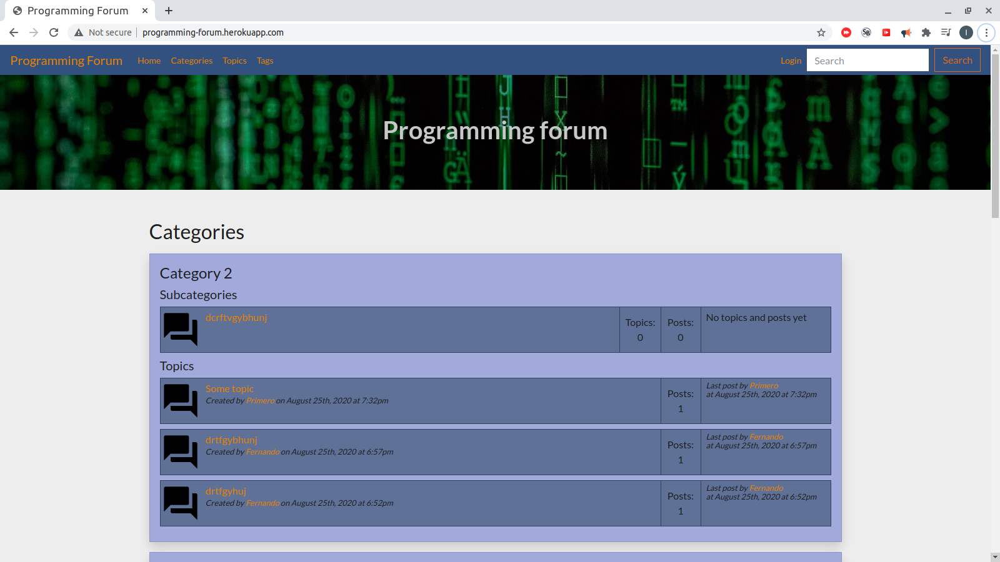

<nav class="navbar bg-primary text-light">

[Przemysław Krogulski](#home) <input type="checkbox" id="toggler"> <label for="toggler" class="navbar__toggler"></label> 

*   [Home](#home)
*   [About me](#about)
*   [Projects](#projects)
*   [Contact](#contact)

</nav>

<header id="home">

<canvas id="canvas"></canvas>

</header>

<main>

<section class="section" id="about">

## About me

<article class="about__article">

### Who am I?

Programming is my passion. I am selfthaught programmer from 2 years. From 1 and half year also selfthaught full stack developer. I am interested in programming, web security, self-development, economics, politics and design.

</article>

<article class="about__article">

### What I do?

I program websites in PHP and Javascript. I have some experience with Laravel and little experience Symfony.

</article>

<article class="about__article">

### Technology stack

PHP

MySQL

PostgreSQL

jQuery

Javascript

HTML

CSS

Laravel

Symfony

</article>

</section>

<section class="section" id="projects">

## Projects

<figure class="project">[

<figcaption class="project__caption">

### Fresh News

News site made with Laravel 7

</figcaption>

](http://yourfreshnews.herokuapp.com)</figure>

<figure class="project">[

<figcaption class="project__caption">

### Programming forum

Forum made with Symfony 5

</figcaption>

](https://programming-forum.herokuapp.com)</figure>

</section>

<section class="section" id="contact">

## Contact

<form class="contact__form" method="post"><label class="contact__form-control contact__form-control--name"><input type="text" class="contact__input" name="name" placeholder=""> Name </label> <label class="contact__form-control contact__form-control--email"> <input type="email" class="contact__input" name="email" placeholder=""> Email </label> <label class="contact__form-control contact__form-control--message"> <textarea class="contact__textarea" name="message" rows="5" placeholder=""></textarea> Message </label> <button class="btn btn-primary contact__form-submit">Send </button> </form>

</section>

</main>

<footer class="footer">

Przemysław Krogulski © <time datetime="2020">2020</time>

</footer>