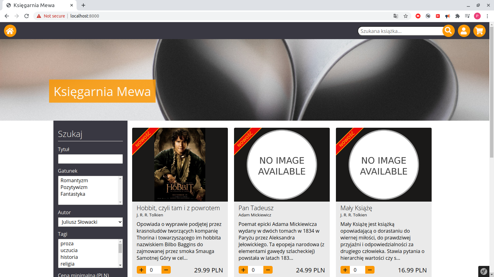

<nav class="navbar bg-primary text-light" aria-labelledby="navbar__brand">

[Przemysław Krogulski](#home) <input type="checkbox" id="toggler" aria-expanded="false" aria-controls="menuList" aria-label="Toggle navigation"> <label for="toggler" class="navbar__toggler"></label> 

*   [Home](#home)
*   [About me](#about)
*   [Projects](#projects)
*   [Contact](#contact)

</nav>

<header id="home">

# Przemysław Krogulski

### Full Stack Developer

</header>

<main>

<section class="section" id="about">

## About me

<article class="about__article animation--fade-in">

### Who am I?

Programming is my passion. I am selfthaught programmer from 2 years. From 1 and half year also selfthaught full stack developer. I am interested in programming, web security, self-development, economics, politics and design.

</article>

<article class="about__article animation--fade-in">

### What I do?

I program websites in PHP and Javascript. I have some experience with Laravel and little experience Symfony.

</article>

<article class="about__article animation--fade-in">

### Technology stack

*   PHP

*   MySQL

*   PostgreSQL

*   jQuery

*   Javascript

*   HTML

*   CSS

*   Laravel

*   Symfony

</article>

</section>

<section class="section" id="projects">

## Projects

<figure class="project animation--fade-in">[

<figcaption class="project__caption">

### Fresh News

News site made with Laravel 7, jQuery and SASS

</figcaption>

](http://yourfreshnews.herokuapp.com)</figure>

<figure class="project animation--fade-in">[

<figcaption class="project__caption">

### Programming forum

Forum made with Symfony 5, jQuery and SASS

</figcaption>

](https://programming-forum.herokuapp.com)</figure>

<figure class="project animation--fade-in">[

<figcaption class="project__caption">

### Księgarnia Mewa

E-commerce made with Symfony 5, Javascript and SASS

</figcaption>

](https://ksiegarnia-mewa.herokuapp.com)</figure>

</section>

<section class="section" id="contact">

## Contact

<form class="contact__form" method="post"><label class="contact__form-control contact__form-control--nam animation--fade-in"><input type="text" class="contact__input" name="name" placeholder=""> Name </label> <label class="contact__form-control contact__form-control--email animation--fade-in"> <input type="email" class="contact__input" name="email" placeholder=""> Email </label> <label class="contact__form-control contact__form-control--message animation--fade-in"> <textarea class="contact__textarea" name="message" rows="5" placeholder=""></textarea> Message </label> <button class="btn btn-primary contact__form-submit animation--fade-in">Send </button> </form>

</section>

</main>

<footer class="footer">

[](https://github.com/Przemar5)[](https://www.linkedin.com/in/przemys%C5%82aw-krogulski-1081ba1b2/)[](https://www.facebook.com/przemo.dzida)

Przemysław Krogulski © <time datetime="2020">2020</time>

</footer>